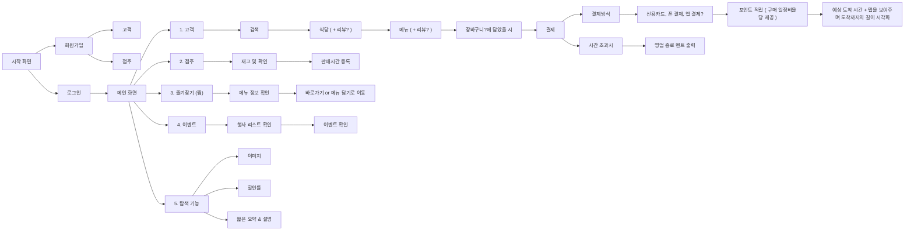

# 6팀 (고성노)

생성일: 2026년 6월 22일 오후 7:06

7/13 전까지 발표자 선정

7/20~ 발표일 예정 / 오프라인

수상을 진행할 예정, 상금은 2학기 지급

### 정확히 개발할 기능 MVP

1. **마감 할인 상품 등록**
    - **점주가 남은 음식과 할인율, 수량, 판매 시간을 등록**
    - **종료 시간 지나면 자동 판매 종료**
2. **내 주변 할인 상품(판매 점포) 검색**
    1. **거리순, 할인율순, 가격순, 마감 시간순으로 정렬**
3. 실시간 재고 관리
    1. 판매 시 재고 자동 차감
    2. 품절 시 자동 표시
4. 구매 기능
5. **리뷰 및 즐겨찾기**
    1. **눈여겨보던 음식 개인적으로 저장 가능**
6. **포인트**
    1. **구매마다 일정 금액 적립**
7. 로그인 / 회원가입
8. 가게 등록 기능 ( → 초반 회원가입에 넣을 예정, 고객도 회원가입하면 이름 뜨는 것처럼 가게도 같은 방식 )
9. 탐색 기능 ( 그냥 검색 안하고 찾아보는 기능 )

### UserFlow

1. 시작 화면
    1. 회원가입
        1. 고객
        2. 점주
    2. 로그인
        1. 메인 화면
            1. 고객
                1. 검색
                    1. 식당 ( + 리뷰? )
                        1. 메뉴 ( ~~+ 리뷰?~~  )
                            1. 장바구니?에 담았을 시
                                1. 결제
                                    1. 결제방식
                                        1. 신용카드, 폰 결제, 앱 결제?
                                            1. 포인트 적립 ( 구매 일정비율당 제공 )
                                                1. 예상 도착 시간 + 맵을 보여주며 도착까지의 길이 시각화
                        2. 시간 초과시
                            1. 영업 종료 멘트 출력
            2. 점주
                1. 재고 및 확인
                    1. 판매시간 등록
                2. 
            3. 즐겨찾기 ( 찜 )
                1. 메뉴 정보 확인
                    1. 바로가기 or 메뉴 담기로 이동
            4. 이벤트
                1. 행사 리스트 확인
                    1. 이벤트 확
            5. 탐색 기능 
                1. 이미지
                2. 할인률
                3. 짧은 요약 & 설명

### ERD

https://dbdiagram.io/d/6a4f38bc4ac62e474c62f2e3

### 역할 분담

디자인 : 가영님 PPT 만드시면 좋을듯

프론트엔드 : 재원님

백엔드 : 서연님, 동재님 (fastapi, h2)

### 배경 지식

프로토콜 : 통신 규약 , 어떻게 통신할건지를 정해놓은 규칙

네트워크 5계층 

HTTP → 브라우저(크롬) 인터넷 들어가면 쓰는게 HTTP

HTTP : 요청(클라이언트→서버) / 응답 (서버→클라이언트)

 요청 : 주소/api엔드포인트 + 데이터(json), 응답 + 데이터(json)

GET, POST, PUT, DELETE : HTTP 메소드

[www.naver.com](http://www.naver.com)**/search : /search 엔드포인트다**

REST API : 엔드포인트 : 리소스 접근하는 자원에 대해서 표현 / HTTP 메소드 (GET, POST …) 으로 행동을 표현

GET : 조회

POST : 생성

PUT : 수정

DELETE : 삭제

[www.naver.com](http://www.naver.com)/boards POST + json으로 데이터 : 게시판을 생성해달라는 요청

[www.naver.com](http://www.naver.com)/boards/{boardID} GET : {boardID}에 해당하는 게시판을 조회

stateless +

REST API 

### API 명세서

[API_명세서](https://app.notion.com/p/API_-39894861f90b8079a306f22062c6a1c2?pvs=21)

[api-docs.html](api-docs.html)

깃허브 이름

- 이동재 : codeXer0

- 이재원

Tanyul

Lnrlf

ddeolyee-fe

deolyee-be

깃허브 조직 초대 & 저장소 생성